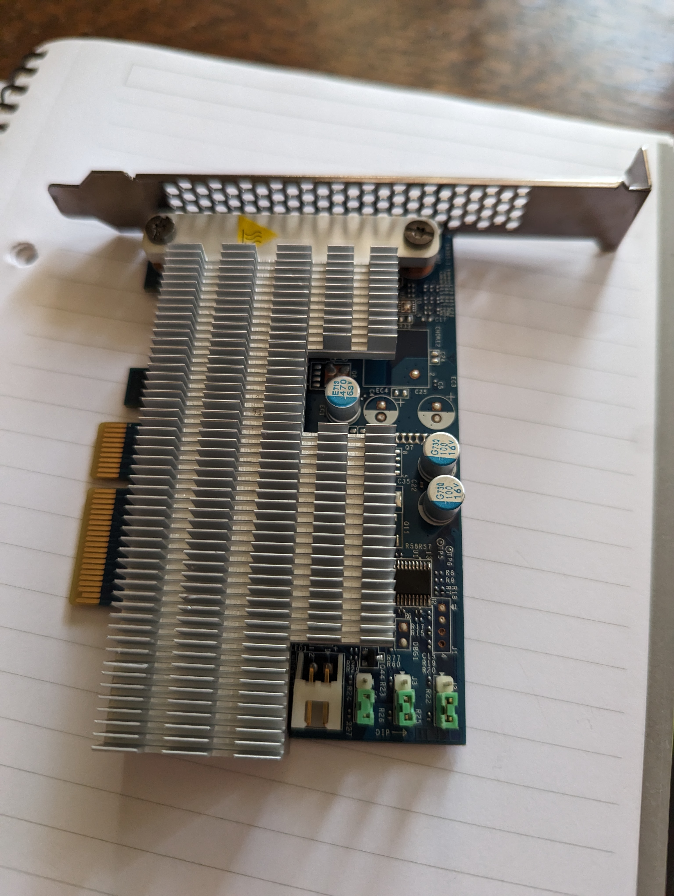
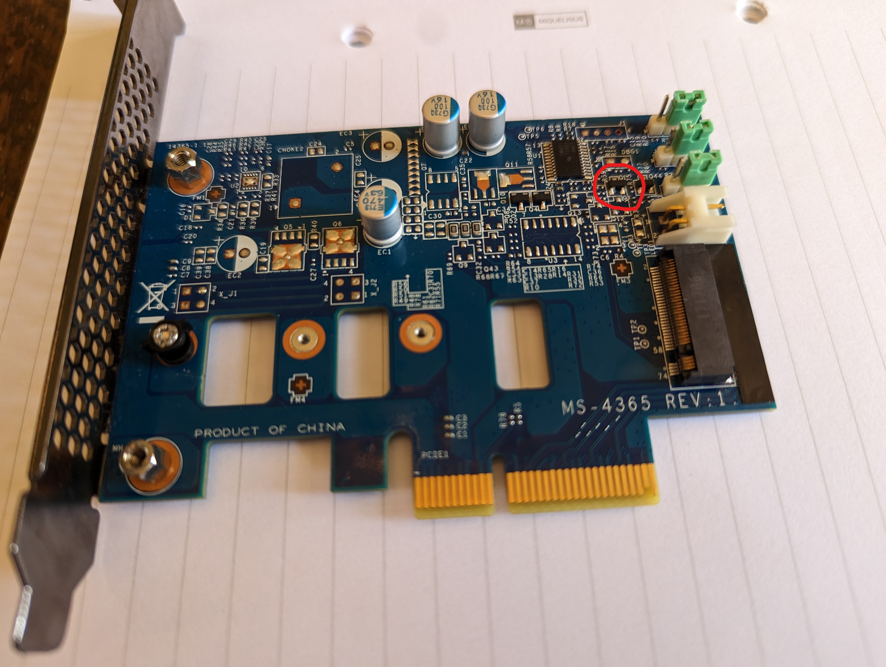
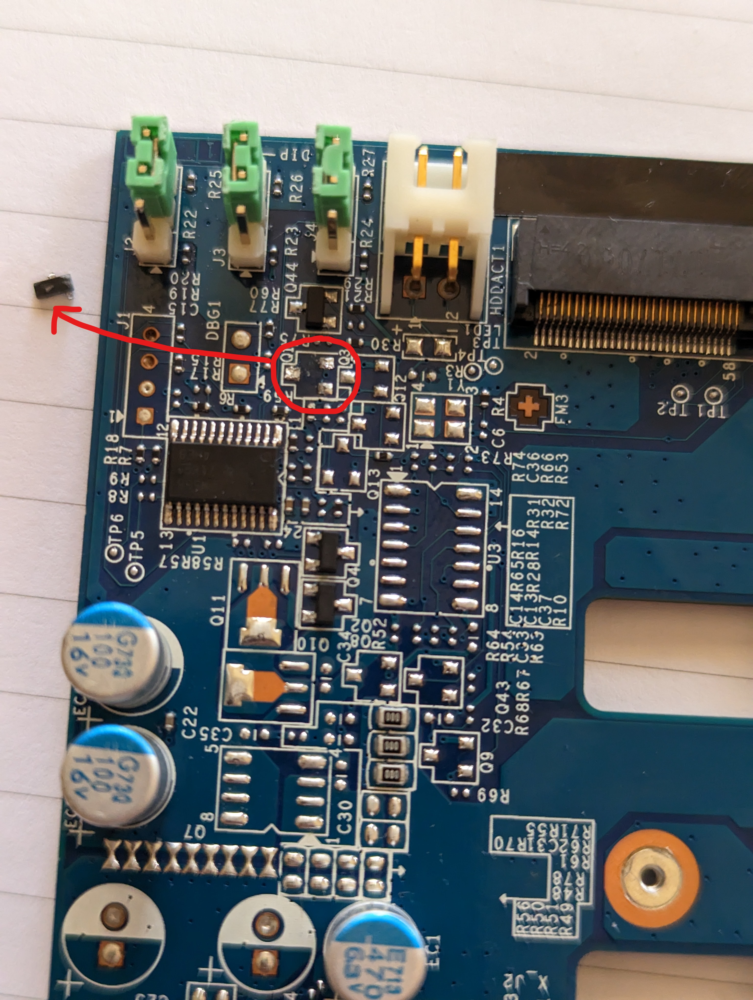

## Modding the HP Z Turbo G2 M.2 PCIe Adapter

### Why, though?

PCIe cards which take a NVME 'drive' - allowing you to add NVME storage even if you're out of M.2 slots (or never had any) - aren't rare or expensive.
They tend to run in the $50 range. The HP card in question here is about a decade old and can be had for about $12 on eBay. However, **however**, ***HOWEVER***: HP - 
in their infinite idiocy - actually spent money and time making sure this particular card wouldn't work outside of a HP Z4xx workstation. 

I *intentionally* purchased one of these locked cards on eBay - not for the savings - they're not significant enough to take a gamble on used hardware. No, **I bought this
card specifically due to this forum post:** https://forums.servethehome.com/index.php?threads/need-help-with-hp-z-turbo-drive-g2-512gb.21195/ 

This, folks, is what made/makes the internet wonderful: a ludicrously niche and esoteric problem posted on a forum, with an absolutely mind-boggling solution posted almost immediately thereafter.

Allow me to quote obrith from the link above:
>We ordered a batch of Z420's in with these cards and some users didn't want the PCIe slot taken up so we ended up with pulls we wanted to use elsewhere. 
You have to remove the Q1 transistor. The card just constantly resets unless the computer sends a command to stop resetting (only the listed HP models will do that) 
unless you physically disable the 'feature'.

Seriously though, [read the thread](https://forums.servethehome.com/index.php?threads/need-help-with-hp-z-turbo-drive-g2-512gb.21195/), it really *is* what makes the internet great.

So, why? That's why - to actively enjoy and support this type of information exchange and hardware hacking.

### So, what's the modification?

That circled component has to go. I don't have pictures of the process because a) I only have two hands and b) nobody should have to watch me wield a soldering iron.
That said, the process is relatively simple - heat up the connections (3 in this case) with the soldering iron tip, and simultaneously pull on the component (tweezers come in handy).

### Results? Results!

It works! This part is very boring - the card does what it is supposed to do. I bought this card to go into a computer that only has a PCIe 2.0 x4 slot available, so I bought a 
very cheap NVME drive for it, because I won't end up getting full NVME speeds from PCIe 2.0 anyway, therefore the drive doesn't need to be particularly fast. Fast for an NVME, that is, this
thing is still hugely faster than SATA SSDs. So this benchmark was less about speed, and more about whether it works or not:

