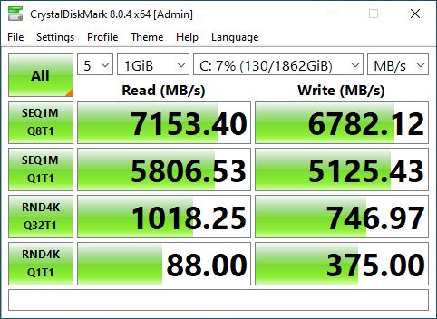
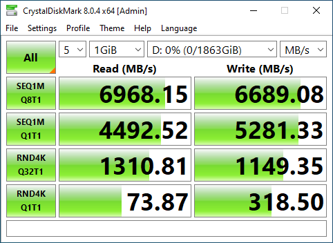
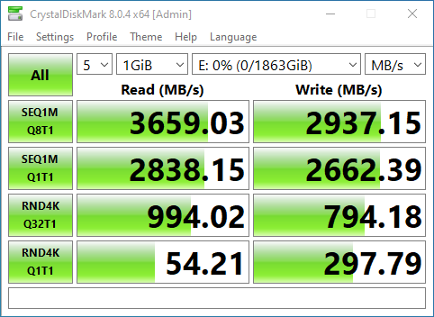

*Disclaimer: These are not real benchmarks, these are some adhoc numbers for my personal amusement. These are the result of 1 run per drive on my machine, there was no attempt
to do multiple runs or otherwise control for any variables.*

## SK Hynix P41 (ASUS Z790 CPU NVME)

This is considered the current top dog in the consumer NVME space. I'm certain that PCIe 5 versions will outperform it relatively soon, but it's plenty fast at the start of 2023.
SK Hynix advertises 7,000 MB/s sequential read and 6,500 MB/s sequential write; 1,200 TBW durability-wise.

## WD SN850X (ASUS Z790 Chipset NVME)

This is the just-as-good or almost-as-good contender to the P41, depending on who you read. Western Digital advertises 7,300 MB/s sequential read and 6,350 MB/s sequential write.

## Kinston NV2 (HP Z Turbo G2 M.2 PCIe Adapter)

One can compare the above two NVME cards, whereas this one is in a different class. I intentionally went bargain hunting, since the [HP PCIe NVME adapter]() is going into a decade-old
PC which only has a PCIe 2.0 slot available, so speeds will be limited by that interface rather than the NVME drive itself. Kingston advertises 3,500 MB/s sequential read speed. You can see
that this drive does indeed have less raw throughput than those above, but - for random-access workloads - it's really keeping up quite well.

---

#### Amazon links in case you're here shopping for some reason:

* [SK Hynix P41](https://amzn.to/3ZaxG06)
* [WD SN850X](https://amzn.to/3ZpAret)
* [Kingston NV2](https://amzn.to/3Z9CPWq)

